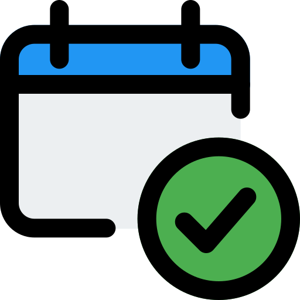

# Tick Calendar - Habit Tracker



**Tick Calendar** is a Progressive Web Application (PWA) designed to help users build and maintain habits by tracking their consistency over time. With an intuitive calendar interface, habit management tools, and insightful statistics, it motivates users to stay on track with their goals. Whether you're trying to exercise daily, read more, or establish any routine, Tick Calendar makes habit tracking simple and engaging.

The current version is live as of **March 23, 2025**, and is built with modern web technologies including HTML, CSS, JavaScript, and Progressive Web App features.

---

## Features

### Habit Management
- **Create and Edit Habits**: Add new habits or modify existing ones with ease.
- **Delete Habits**: Remove habits you no longer want to track.
- **Habit Selection**: Switch between multiple habits to view their individual progress.

### Calendar View
- **Monthly Calendar**: Displays the current month with clickable dates to mark habit completion.
- **Navigation**: Move between months using buttons or swipe gestures (on mobile).
- **Visual Feedback**: Days marked as complete are highlighted, with a special indicator for today.

### Year Overview (Heatmap)
- **365-Day Heatmap**: A year-long view showing habit consistency with color intensity.
- **Interactive**: Click heatmap cells to toggle completion status for any day.

### Statistics
- **Current Streak**: Tracks your ongoing streak of consecutive days.
- **Longest Streak**: Displays your best streak to date.
- **Total Days**: Counts the total number of days you've completed the habit.

### Mobile-Friendly Design
- **Responsive Layout**: Adapts seamlessly to desktop and mobile screens.
- **Mobile Navigation**: Tabbed interface for easy access to calendar, habits, and stats.
- **Swipe Gestures**: Navigate months with intuitive swipes on the calendar.

### Progressive Web App (PWA)
- **Installable**: Add Tick Calendar to your home screen for a native app-like experience.
- **Offline Support**: Works offline using a service worker (requires `service_worker.js` implementation).
- **Push Notifications**: Potential for future notification features (not yet implemented).

### Additional Features
- **Toast Notifications**: Feedback messages for actions like marking days or creating habits.
- **Local Storage**: Persists your habit data across sessions using browser local storage.
- **Dark Mode**: Automatically adapts to your system's dark mode preference.

---

## Demo

[Visit Live Site](https://mohits2806.github.io/tickCalendar)

---

## Installation

To run Tick Calendar locally or contribute to its development, follow these steps:

### Prerequisites
- A modern web browser (Chrome, Firefox, Safari, Edge, etc.).
- A local development server (e.g., [Live Server](https://marketplace.visualstudio.com/items?itemName=ritwickdey.LiveServer) for VS Code, or Node.js with `http-server`).
- Git (optional, for cloning the repository).

### Steps
1. **Clone the Repository**
   ```bash
   git clone https://github.com/[your-username]/tick-calendar.git
   cd tick-calendar
   ```

2. **Set Up Project Files**
   Ensure the following files are present:
   - `index.html`: The main HTML file.
   - `script.js`: The JavaScript logic for the app.
   - `style.css`: The stylesheet (create this if not already present).
   - `logo.png`: The app logo (replace with your own or a placeholder).
   - `manifest.json`: The PWA manifest file (create a basic one if missing).
   - `service_worker.js`: The service worker file (create a basic one for offline support).

   Example `manifest.json`:
   ```json
   {
     "name": "Tick Calendar",
     "short_name": "TickCal",
     "start_url": "/index.html",
     "display": "standalone",
     "background_color": "#ffffff",
     "theme_color": "#6200ee",
     "icons": [
       {
         "src": "logo.png",
         "sizes": "192x192",
         "type": "image/png"
       }
     ]
   }
   ```

   Example `service_worker.js` (basic caching):
   ```javascript
   self.addEventListener('install', (event) => {
     event.waitUntil(
       caches.open('tick-calendar-v1').then((cache) => {
         return cache.addAll([
           '/',
           '/index.html',
           '/style.css',
           '/script.js',
           '/logo.png'
         ]);
       })
     );
   });

   self.addEventListener('fetch', (event) => {
     event.respondWith(
       caches.match(event.request).then((response) => {
         return response || fetch(event.request);
       })
     );
   });
   ```

3. **Run a Local Server**
   - Using VS Code Live Server: Right-click `index.html` and select "Open with Live Server".
   - Using Node.js: Install `http-server` (`npm install -g http-server`), then run `http-server` in the project directory.

4. **Open in Browser**
   Navigate to `http://localhost:8080` (or the port provided by your server) to view the app.

---

## Usage

1. **Getting Started**
   - On first load, a default habit ("My First Habit") is created automatically.
   - A welcome toast will prompt you to create your first habit if none exist.

2. **Tracking Habits**
   - Click a date on the calendar or heatmap to mark/unmark it as completed.
   - Watch your streaks and total days update in real-time.

3. **Managing Habits**
   - Click "New Habit" (sidebar or mobile button) to add a habit.
   - Select a habit from the dropdown (mobile) or sidebar (desktop) to switch views.
   - Edit or delete habits using the respective buttons in the habit list.

4. **Navigation**
   - Use the arrow buttons or swipe left/right to change months.
   - On mobile, use the bottom navigation tabs to switch between Calendar, Habits, and Stats views.

5. **Installing as a PWA**
   - After a few seconds, an install prompt appears (on supported browsers).
   - Click "Install" to add Tick Calendar to your device’s home screen.

---

## Project Structure

```
tick-calendar/
├── index.html         # Main HTML file
├── script.js          # JavaScript logic
├── style.css          # Stylesheet (to be created)
├── logo.png           # App logo
├── manifest.json      # PWA manifest
├── service_worker.js  # Service worker for offline support
└── README.md          # This file
```

---

## Contributing

Contributions are welcome! To contribute:

1. **Fork the Repository**
   Click the "Fork" button on GitHub to create your own copy.

2. **Create a Branch**
   ```bash
   git checkout -b feature/your-feature-name
   ```

3. **Make Changes**
   Implement your feature or bug fix.

4. **Commit and Push**
   ```bash
   git commit -m "Add your feature description"
   git push origin feature/your-feature-name
   ```

5. **Submit a Pull Request**
   Open a pull request on GitHub with a detailed description of your changes.

### Suggestions
- Add CSS animations for smoother transitions (currently using basic JavaScript animations).
- Implement notifications for habit reminders.
- Add data export/import functionality.
- Enhance the service worker for better offline capabilities.

---

## Technologies Used

- **HTML5**: Structure and semantics.
- **CSS3**: Styling (requires `style.css` implementation).
- **JavaScript (ES6+)**: Core logic and interactivity.
- **Progressive Web App APIs**: Service Worker, Manifest, Install Prompt.
- **Local Storage**: Persistent data storage.
- **Framer Motion** (optional): For advanced animations (loaded via CDN).

---

## License
This project is licensed under the [MIT License](LICENSE). Feel free to use, modify, and distribute it as you see fit.

---

## Acknowledgments

- Inspired by habit-tracking concepts from "Atomic Habits" by James Clear.
- Built with love by Mohit Shahawale.

---

## Contact

For questions or feedback, reach out to me at:
- GitHub: [mohits2806](https://github.com/mohits2806)
- Email: [mohitshaharwale01@gmail.com](mailto://mohitshaharwale01@gmail.com)

Happy habit tracking!
